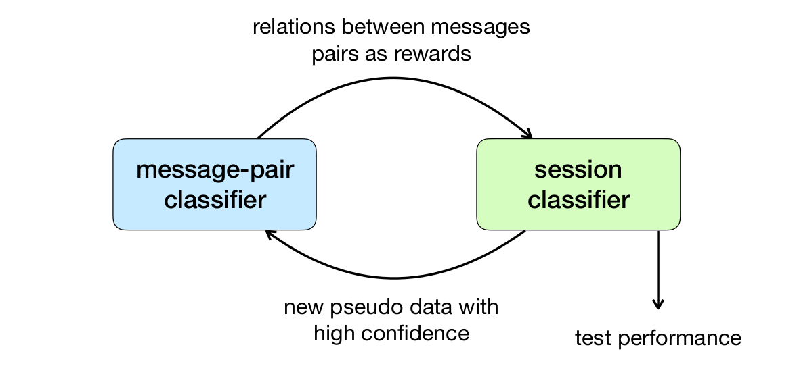

# Unsupervised-dialo-disentanglement

This respository contains the source code of the paper [Unsupervised Conversation Disentanglement through Co-Training]() which is published in EMNLP 2021. In this work, we explore training a conversation disentanglement model without referencing any human annotations. Our method is built upon the deep co-training algorithm. Experimental results on the large Movie Dialogue Dataset demonstrate that our proposed approach achieves competitive performance compared to previous supervised methods. The Movie Dialogue Dataset can be downloaded from [here](https://github.com/LayneIns/E2E-dialo-disentanglement).


*Illustration of our proposed co-training framework*

## Pre-training

### Message-pair Classifier
To initialize the Message-pair Classifier, we can build the pseudo dataset by retrieving the message pairs from the same speaker in a conversation and by using the query-output pairs predicted by DialoGPT. Generally the format of the pseudo dataset is as below:

	[
		["You're a big kid now. ", "It's still sick. ", 0], 
		["We didnt do nothin special I can  remember.  Just talked, is all. ", "Is that the truth? ", 0],
		["What's that? ", "It's beautiful. Thanks. ", 1],
		...
	 ]

You can finetune the message-pair classifier with the built pseudo dataset:
```
cd ./pretrain/message-pair-classifier/
python bert_train.py --data_name movie --aug_type same_speaker --model_config bert-base-uncased --num_training_epochs 2 --logging_steps 100 --save_steps 800 --fp16
```
You can evaluate the performance of the finetuned model by:
```
cd ./pretrain/message-pair-classifier/
python bert_eval_disentangle.py --data_type dev --data_name movie --aug_type same_speaker --model_path output/movie/same_speaker/2021-Feb-27-04_48_12/cache/ckpt-800/ --per_gpu_eval_batch_size 128 --fp16
```

### Session Classifier
Similarly as the message-pair classifier, we can build the pseudo data to initialize the Session Classifier. The format of the pseudo dataset is as:

	[
		{
			"messages": [[speaker_1, text_1], [speaker_2, text_2], ...],
			"current_message": [speaker_n, text_n],
			"label": 1
		},
		{
			"messages": [[speaker_1, text_1], [speaker_2, text_2], ...],
			"current_message": [speaker_n, text_n],
			"label": 0
		},
		...
	 ]

You can pre-train the Session Classifier with the pseudo dataset as:
```
cd ./pretrain/session-classifier/
python main.py --bidirectional --per_gpu_batch_size 1024 --save_steps 2500 --logging_steps 250 --epochs 20 --lr 1e-3
```
You can evaluate the performance as:
```
cd ./pretrain/session-classifier/
python disentangle_inference.py --output_dir output/movie/single/2021-Apr-06-02_02_52/ --checkpoint -1 --bidirectional --per_gpu_batch_size 512
```

